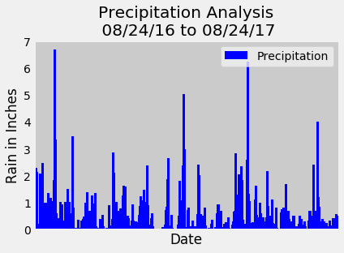
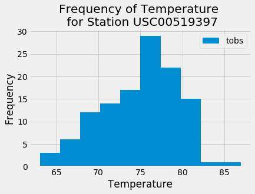
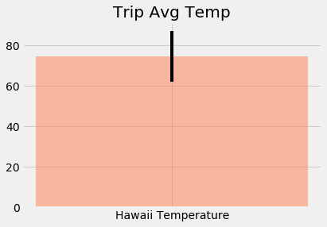

# Surf's Up

#### Data analysis project working with weather data from Honolulu, Hawaii to perform climate analysis & exploration
 - Perform *exploratory climate analysis* by tinkering with data and present results by category: *precipitation*, *station* and *temperature*
 - Wrap up results of exploration into a Python Flask based **Climate App** that includes *specific* routes to display each type of analysis

### Import Dependencies


```python
import numpy as np
import pandas as pd

import datetime as dt

%matplotlib inline
from matplotlib import style
style.use('fivethirtyeight')
import matplotlib.pyplot as plt
import matplotlib.dates as mdates
```

### Connect to SQLite Database using SQLAlchemy ORM

#### Import SQLAlchemy Dependencies


```python
import sqlalchemy

from sqlalchemy.ext.automap import automap_base
from sqlalchemy.orm import Session
from sqlalchemy import create_engine, func
```

#### Determine dates in the range of 3-15 for your vacation

<blockquote> Date Range will be 2014-07-20 to 2014-07-28 </blockquote>

#### SQLAlchemy database connections


```python
# Create an 'engine' object and plug in DB Type (and connector)
engine = create_engine("sqlite:///Resources/hawaii.sqlite")
```


```python
# Extend the automap_base to access existing data models
Base = automap_base()

# Reflect the tables in the DB
Base.prepare(engine, reflect=True)
```


```python
# Display the classnames of the data models (names of the tables in DB)
Base.classes.keys()
```


    ['measurement', 'station']


```python
# Create references to the classnames of the data models (variables to refer to DB tables)
Measurement = Base.classes.measurement
Station = Base.classes.station
```


```python
# Create and bind a session (persistent DB connection) to the engine
session = Session(engine)
```

## Exploratory Climate Analysis

### Precipitation Analysis

#### Design a query to retrieve the last 12 months of precipitation data


```python
# Pass in classname of data model, filter precipitation data for the specified date range and sort values by 'date'

prcp_query = session.query(Measurement.id, Measurement.prcp, Measurement.date).\
    filter(Measurement.date.between('2016-08-23', '2017-08-23')).\
    order_by(Measurement.date).\
    all()                                
```

#### Save the query results as a pandas dataframe and set the 'date' column as index


```python
prcp_df = pd.DataFrame(prcp_query)
prcp_df.set_index('id', inplace=True)
prcp_df.head()
```


<div>
<style scoped>
    .dataframe tbody tr th:only-of-type {
        vertical-align: middle;
    }

    .dataframe tbody tr th {
        vertical-align: top;
    }

    .dataframe thead th {
        text-align: right;
    }
</style>
<table border="1" class="dataframe">
  <thead>
    <tr style="text-align: right;">
      <th></th>
      <th>prcp</th>
      <th>date</th>
    </tr>
    <tr>
      <th>id</th>
      <th></th>
      <th></th>
    </tr>
  </thead>
  <tbody>
    <tr>
      <th>2364</th>
      <td>0.00</td>
      <td>2016-08-23</td>
    </tr>
    <tr>
      <th>5091</th>
      <td>0.15</td>
      <td>2016-08-23</td>
    </tr>
    <tr>
      <th>7331</th>
      <td>0.05</td>
      <td>2016-08-23</td>
    </tr>
    <tr>
      <th>8825</th>
      <td>NaN</td>
      <td>2016-08-23</td>
    </tr>
    <tr>
      <th>11851</th>
      <td>0.02</td>
      <td>2016-08-23</td>
    </tr>
  </tbody>
</table>
</div>


#### Plot the precipitation data stored in the dataframe


```python
# Using Matplotlib to plot precipitation data

prcp_df.plot.bar('date', 'prcp', width=18, color='blue')
plt.xlabel('Date')
plt.tick_params (
    axis = 'x',
    which = "both",
    bottom = True,
    top = False,
    labelbottom = False)
plt.ylabel("Rain in Inches")
plt.title("Precipitation Analysis\n 08/24/16 to 08/24/17")
plt.legend(["Precipitation"], loc='upper right')
plt.grid(True)
plt.savefig("output/Prcp Analysis.png")
plt.show()
```





```python
# Use pandas to calcualte the summary statistics for the precipitation data
prcp_df.describe()
```


<div>
<style scoped>
    .dataframe tbody tr th:only-of-type {
        vertical-align: middle;
    }

    .dataframe tbody tr th {
        vertical-align: top;
    }

    .dataframe thead th {
        text-align: right;
    }
</style>
<table border="1" class="dataframe">
  <thead>
    <tr style="text-align: right;">
      <th></th>
      <th>prcp</th>
    </tr>
  </thead>
  <tbody>
    <tr>
      <th>count</th>
      <td>2021.000000</td>
    </tr>
    <tr>
      <th>mean</th>
      <td>0.177279</td>
    </tr>
    <tr>
      <th>std</th>
      <td>0.461190</td>
    </tr>
    <tr>
      <th>min</th>
      <td>0.000000</td>
    </tr>
    <tr>
      <th>25%</th>
      <td>0.000000</td>
    </tr>
    <tr>
      <th>50%</th>
      <td>0.020000</td>
    </tr>
    <tr>
      <th>75%</th>
      <td>0.130000</td>
    </tr>
    <tr>
      <th>max</th>
      <td>6.700000</td>
    </tr>
  </tbody>
</table>
</div>


### Station Analysis

#### Design a query to calculate total number of stations


```python
stn_query = session.query(func.count(Station.station)).all()

print(f"Total count of stations is {stn_query[0][0]}")
```

    Total count of stations is 9


#### Design a query to find the most active stations


```python
actv_stn_query = session.query(Measurement.station, func.count(Measurement.tobs)).\
    group_by(Measurement.station).\
    order_by(func.count(Measurement.tobs).desc())

# List the stations and observation counts in descending order
actv_stn_df = pd.DataFrame(actv_stn_query, columns=['station', 'num_obs'])
actv_stn_df.head()
```


<div>
<style scoped>
    .dataframe tbody tr th:only-of-type {
        vertical-align: middle;
    }

    .dataframe tbody tr th {
        vertical-align: top;
    }

    .dataframe thead th {
        text-align: right;
    }
</style>
<table border="1" class="dataframe">
  <thead>
    <tr style="text-align: right;">
      <th></th>
      <th>station</th>
      <th>num_obs</th>
    </tr>
  </thead>
  <tbody>
    <tr>
      <th>0</th>
      <td>USC00519281</td>
      <td>2772</td>
    </tr>
    <tr>
      <th>1</th>
      <td>USC00519397</td>
      <td>2724</td>
    </tr>
    <tr>
      <th>2</th>
      <td>USC00513117</td>
      <td>2709</td>
    </tr>
    <tr>
      <th>3</th>
      <td>USC00519523</td>
      <td>2669</td>
    </tr>
    <tr>
      <th>4</th>
      <td>USC00516128</td>
      <td>2612</td>
    </tr>
  </tbody>
</table>
</div>


<blockquote> From the above dataframe, we conclude station 'USC00519281' has highest number of observations at 2772 </blockquote>

#### Design a query to retrieve the last 12 months of temperature observation data


```python
tobs_query = session.query(Measurement.id, Measurement.tobs, Measurement.date).\
    filter(Measurement.date.between('2016-08-23', '2017-08-23')).\
    order_by(Measurement.date).\
    all()

tobs_df = pd.DataFrame(tobs_query)
tobs_df.set_index('id', inplace=True)
tobs_df.head()
```


<div>
<style scoped>
    .dataframe tbody tr th:only-of-type {
        vertical-align: middle;
    }

    .dataframe tbody tr th {
        vertical-align: top;
    }

    .dataframe thead th {
        text-align: right;
    }
</style>
<table border="1" class="dataframe">
  <thead>
    <tr style="text-align: right;">
      <th></th>
      <th>tobs</th>
      <th>date</th>
    </tr>
    <tr>
      <th>id</th>
      <th></th>
      <th></th>
    </tr>
  </thead>
  <tbody>
    <tr>
      <th>2364</th>
      <td>81.0</td>
      <td>2016-08-23</td>
    </tr>
    <tr>
      <th>5091</th>
      <td>76.0</td>
      <td>2016-08-23</td>
    </tr>
    <tr>
      <th>7331</th>
      <td>80.0</td>
      <td>2016-08-23</td>
    </tr>
    <tr>
      <th>8825</th>
      <td>80.0</td>
      <td>2016-08-23</td>
    </tr>
    <tr>
      <th>11851</th>
      <td>80.0</td>
      <td>2016-08-23</td>
    </tr>
  </tbody>
</table>
</div>


```python
# Return the station with the maximum number of temperature observations
maxTempStn_query = session.query(Measurement.station, func.max(Measurement.tobs)).\
    filter(Measurement.prcp > 0).\
    first()

maxTempStn = maxTempStn_query[0]

# Return temperature observations of the last 12 months for the above station
tempFreq_maxStn_query = session.query(Measurement.date, Measurement.tobs).\
    filter_by(station = maxTempStn).\
    filter(Measurement.date.between('2016-08-23', '2017-08-23')).\
    filter(Measurement.prcp > 0).\
    all()

tempFreq_maxStn_dict = dict(tempFreq_maxStn_query)
tempFreqs = tempFreq_maxStn_dict.values()

# Plot those temperature observations on a histogram with bins=12
plt.hist(tempFreqs)
plt.title("Frequency of Temperature \n for Station USC00519397")
plt.xlabel("Temperature")
plt.ylabel("Frequency")
plt.legend(['tobs'])
plt.savefig("output/Temperature Frequencies For Station USC00519397.png")
plt.show()
```





### Temperature Analysis

<blockquote> A function called <b>calc_temps</b> will accept a startdate and enddate in the format <b><i>'%Y-%m-%d'</i></b> and return the <i>minimum</i>, <i>maximum</i> and <i>average</i> temperatures for that range of dates </blockquote>


```python
def calc_temps(start_date, end_date):
    """TMIN, TAVG, and TMAX for a list of dates.

    Args:
        start_date (string): A date string in the format %Y-%m-%d
        end_date (string): A date string in the format %Y-%m-%d

    Returns:
        TMIN, TAVE, and TMAX
    """

    results = session.query(func.min(Measurement.tobs), func.avg(Measurement.tobs), func.max(Measurement.tobs)).\
        filter(Measurement.date >= start_date).filter(Measurement.date <= end_date).all()
    resultsList = list(np.ravel(results))
    return resultsList

# function usage example
print(calc_temps('2012-02-28', '2012-03-05'))
```

    [62.0, 69.57142857142857, 74.0]


#### Use the calc_temps function to calculate the min, avg, and max temperatures for your trip using the matching dates from the previous year


```python
min_avg_max_temps = calc_temps('2016-08-23', '2017-08-23')

tmin = min_avg_max_temps[0]
tave = min_avg_max_temps[1]
tmax = min_avg_max_temps[2]
```

#### Plot the min, avg, and max temperature from your previous query as a bar chart


```python
# Use the average temperature as the bar height

x = ["Hawaii Temperature"]

# Use the peak-to-peak (tmax-tmin) value as the y error bar (yerr)

yerr = tmax - tave

plt.bar(x, tave, color="coral", alpha=0.5, yerr=yerr)
plt.title("Trip Avg Temp")
plt.savefig("output/Trip Avg Temp.png")
plt.show()
```





### Climate Analysis for Vacation Dates

#### Calculate rainfall per weather station for trip dates selected

<blockquote> Sort results by descending order of precipitation and list <i> station, name, latitude, longitude </i> and <i> elevation </i> for the columns </blockquote>


```python
rainfallPerStation = session.query(Station.name, Measurement.station, func.sum(Measurement.prcp), Station.latitude, Station.longitude).\
    group_by(Measurement.station).\
    filter(Station.station == Measurement.station).\
    filter(Measurement.date.between('2014-07-20', '2014-07-28')).\
    all()

rainfall_df = pd.DataFrame(rainfallPerStation, columns = ['name', 'statiob', 'prcp', 'lat', 'long'])
rainfall_df
```


<div>
<style scoped>
    .dataframe tbody tr th:only-of-type {
        vertical-align: middle;
    }

    .dataframe tbody tr th {
        vertical-align: top;
    }

    .dataframe thead th {
        text-align: right;
    }
</style>
<table border="1" class="dataframe">
  <thead>
    <tr style="text-align: right;">
      <th></th>
      <th>name</th>
      <th>statiob</th>
      <th>prcp</th>
      <th>lat</th>
      <th>long</th>
    </tr>
  </thead>
  <tbody>
    <tr>
      <th>0</th>
      <td>HONOLULU OBSERVATORY 702.2, HI US</td>
      <td>USC00511918</td>
      <td>1.12</td>
      <td>21.31520</td>
      <td>-157.99920</td>
    </tr>
    <tr>
      <th>1</th>
      <td>KANEOHE 838.1, HI US</td>
      <td>USC00513117</td>
      <td>6.41</td>
      <td>21.42340</td>
      <td>-157.80150</td>
    </tr>
    <tr>
      <th>2</th>
      <td>KUALOA RANCH HEADQUARTERS 886.9, HI US</td>
      <td>USC00514830</td>
      <td>12.45</td>
      <td>21.52130</td>
      <td>-157.83740</td>
    </tr>
    <tr>
      <th>3</th>
      <td>MANOA LYON ARBO 785.2, HI US</td>
      <td>USC00516128</td>
      <td>7.96</td>
      <td>21.33310</td>
      <td>-157.80250</td>
    </tr>
    <tr>
      <th>4</th>
      <td>PEARL CITY, HI US</td>
      <td>USC00517948</td>
      <td>0.00</td>
      <td>21.39340</td>
      <td>-157.97510</td>
    </tr>
    <tr>
      <th>5</th>
      <td>WAIHEE 837.5, HI US</td>
      <td>USC00519281</td>
      <td>9.00</td>
      <td>21.45167</td>
      <td>-157.84889</td>
    </tr>
    <tr>
      <th>6</th>
      <td>WAIKIKI 717.2, HI US</td>
      <td>USC00519397</td>
      <td>1.89</td>
      <td>21.27160</td>
      <td>-157.81680</td>
    </tr>
    <tr>
      <th>7</th>
      <td>WAIMANALO EXPERIMENTAL FARM, HI US</td>
      <td>USC00519523</td>
      <td>6.02</td>
      <td>21.33556</td>
      <td>-157.71139</td>
    </tr>
  </tbody>
</table>
</div>


#### Conclusions to plan for a Trip in July 2014

<blockquote> Based on rainfall observations <i> per station </i> for my pre-selected vacation dates, I can safely conclude:

    1. Choose any area closer to the 'Pearl' weather station if I want to spend all day outside so as to maximize my chances of "sun, sand and surf"
    2. Choose any area closer to the 'Kualoa Ranch Headquarters' weather station if I choose to relax and stay indoors since chances of heavy rainfall are higher on average
</blockquote>
