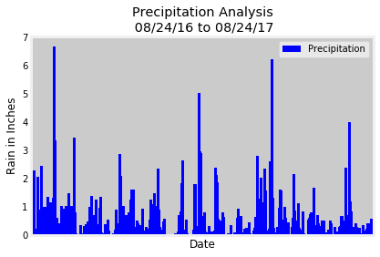
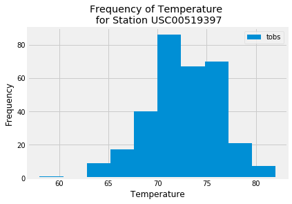
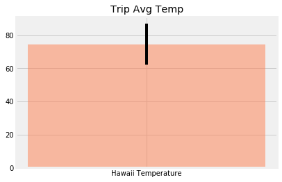

```python
%matplotlib inline
from matplotlib import style
style.use('fivethirtyeight')
import matplotlib.pyplot as plt
import matplotlib.dates as mdates
```


```python
import numpy as np
import pandas as pd
```


```python
import datetime as dt
```

# Reflect Tables into SQLAlchemy ORM


```python
# Python SQL toolkit and Object Relational Mapper
import sqlalchemy
from sqlalchemy.ext.automap import automap_base
from sqlalchemy.orm import Session
from sqlalchemy import create_engine, func
```


```python
engine = create_engine("sqlite:///Resources/hawaii.sqlite")
```


```python
# reflect an existing database into a new model
Base = automap_base()
# reflect the tables
Base.prepare(engine, reflect=True)
```


```python
# We can view all of the classes that automap found
Base.classes.keys()
```


    ['measurement', 'station']


```python
# Save references to each table
Measurement = Base.classes.measurement
Station = Base.classes.station
```


```python
# Create our session (link) from Python to the DB
session = Session(engine)
```

# Exploratory Climate Analysis


```python
# Design a query to retrieve the last 12 months of precipitation data and plot the results
datequery = session.query(Measurement.id, Measurement.date, Measurement.prcp).filter(Measurement.date.between('2016-08-23', '2017-08-23')).order_by(Measurement.date).all()
# datequery

# Save the query results as a Pandas DataFrame and set the index to the date column
precipitation_df = pd.DataFrame(datequery)
# precipitation_df.head()

# Use Pandas Plotting with Matplotlib to plot the data
precipitation_df.plot.bar('date', 'prcp', width=18, color='blue')
plt.xlabel('Date')
plt.tick_params (
    axis = 'x',
    which = "both",
    bottom = True,
    top = False,
    labelbottom = False)
plt.ylabel("Rain in Inches")
plt.title("Precipitation Analysis\n 08/24/16 to 08/24/17")
plt.legend(["Precipitation"])
plt.grid(True)
plt.savefig("Images/Precipitation Analysis.png")
plt.show()
```





```python
# Use Pandas to calcualte the summary statistics for the precipitation data
precipitation_df.describe()
```
<table border="1" class="dataframe">
  <thead>
    <tr style="text-align: right;">
      <th></th>
      <th>id</th>
      <th>prcp</th>
    </tr>
  </thead>
  <tbody>
    <tr>
      <th>count</th>
      <td>2230.000000</td>
      <td>2021.000000</td>
    </tr>
    <tr>
      <th>mean</th>
      <td>10158.570404</td>
      <td>0.177279</td>
    </tr>
    <tr>
      <th>std</th>
      <td>5603.500203</td>
      <td>0.461190</td>
    </tr>
    <tr>
      <th>min</th>
      <td>2364.000000</td>
      <td>0.000000</td>
    </tr>
    <tr>
      <th>25%</th>
      <td>5287.250000</td>
      <td>0.000000</td>
    </tr>
    <tr>
      <th>50%</th>
      <td>8930.500000</td>
      <td>0.020000</td>
    </tr>
    <tr>
      <th>75%</th>
      <td>14750.750000</td>
      <td>0.130000</td>
    </tr>
    <tr>
      <th>max</th>
      <td>19550.000000</td>
      <td>6.700000</td>
    </tr>
  </tbody>
</table>
</div>


```python
# Design a query to show how many stations are available in this dataset?
stationquery = session.query(Station.station, Station.station).count()
print(f"Total number of stations: {stationquery}")
```

    Total number of stations: 9


```python
# What are the most active stations? (i.e. what stations have the most rows)?
# List the stations and the counts in descending order.
activeStations = session.query(Measurement.station, func.count(Measurement.tobs)).group_by(Measurement.station).order_by(func.count(Measurement.tobs).desc())
# activeStations.all()

activeStationsList = list(activeStations)
activeStations_df = pd.DataFrame(activeStationsList, columns = ['Station', 'Count'])
activeStations_df
```
<table border="1" class="dataframe">
  <thead>
    <tr style="text-align: right;">
      <th></th>
      <th>Station</th>
      <th>Count</th>
    </tr>
  </thead>
  <tbody>
    <tr>
      <th>0</th>
      <td>USC00519281</td>
      <td>2772</td>
    </tr>
    <tr>
      <th>1</th>
      <td>USC00519397</td>
      <td>2724</td>
    </tr>
    <tr>
      <th>2</th>
      <td>USC00513117</td>
      <td>2709</td>
    </tr>
    <tr>
      <th>3</th>
      <td>USC00519523</td>
      <td>2669</td>
    </tr>
    <tr>
      <th>4</th>
      <td>USC00516128</td>
      <td>2612</td>
    </tr>
    <tr>
      <th>5</th>
      <td>USC00514830</td>
      <td>2202</td>
    </tr>
    <tr>
      <th>6</th>
      <td>USC00511918</td>
      <td>1979</td>
    </tr>
    <tr>
      <th>7</th>
      <td>USC00517948</td>
      <td>1372</td>
    </tr>
    <tr>
      <th>8</th>
      <td>USC00518838</td>
      <td>511</td>
    </tr>
  </tbody>
</table>
</div>


```python
# Using the station id from the previous query, calculate the lowest temperature recorded, 
# highest temperature recorded, and average temperature most active station?
lowestTemperature = session.query(func.min(Measurement.tobs)).group_by(Measurement.station).order_by(func.count(Measurement.tobs).desc()).first()
print(f"The lowest temperature recorded is: {lowestTemperature}")

highestTemperature = session.query(func.max(Measurement.tobs)).group_by(Measurement.station).order_by(func.count(Measurement.tobs).desc()).first()
print(f"The highest temperature recorded is: {highestTemperature}")

averageTemperature = session.query(func.avg(Measurement.tobs)).group_by(Measurement.station).order_by(func.count(Measurement.tobs).desc()).first()
print(f"The average temperature recorded is: {averageTemperature}")
```

    The lowest temperature recorded is: (54.0,)
    The highest temperature recorded is: (85.0,)
    The average temperature recorded is: (71.66378066378067,)


```python
# Choose the station with the highest number of temperature observations.
highestTemperatureStation = session.query(Measurement.station, func.max(Measurement.tobs)).filter(Measurement.prcp > 0).first()
highestTemperatureStation

# Query the last 12 months of temperature observation data for this station and plot the results as a histogram
tempsObserved12Months = session.query(Measurement.date, Measurement.tobs).filter(Measurement.prcp > 0).filter(Measurement.date.between('2016-08-23', '2017-08-23')).all()
tempsObserved12Months_dict = dict(tempsObserved12Months)
tempsObserved12Months_dates = list(tempsObserved12Months_dict.keys())
tempsObserved12Months_temps = list(tempsObserved12Months_dict.values())

plt.hist(tempsObserved12Months_temps)
plt.title("Frequency of Temperature \n for Station USC00519397")
plt.xlabel("Temperature")
plt.ylabel("Frequency")
plt.legend(['tobs'])
plt.savefig("Images/Frequency of Temperature \n for Station USC00519397.jpg")
plt.show()
```





```python
# This function called `calc_temps` will accept start date and end date in the format '%Y-%m-%d' 
# and return the minimum, average, and maximum temperatures for that range of dates
def calc_temps(start_date, end_date):
    """TMIN, TAVG, and TMAX for a list of dates.
    
    Args:
        start_date (string): A date string in the format %Y-%m-%d
        end_date (string): A date string in the format %Y-%m-%d
        
    Returns:
        TMIN, TAVE, and TMAX
    """
    
    results = session.query(func.min(Measurement.tobs), func.avg(Measurement.tobs), func.max(Measurement.tobs)).\
        filter(Measurement.date >= start_date).filter(Measurement.date <= end_date).all()
    
    resultsList = list(np.ravel(results))
    
    return resultsList

# function usage example
print(calc_temps('2012-02-28', '2012-03-05'))
```

    [62.0, 69.57142857142857, 74.0]


```python
# Use your previous function `calc_temps` to calculate the tmin, tavg, and tmax 
# for your trip using the previous year's data for those same dates.
min_avg_max_temps = calc_temps('2016-08-23', '2017-08-23')
tmin = min_avg_max_temps[0]
tave = min_avg_max_temps[1]
tmax = min_avg_max_temps[2]
```


```python
# Plot the results from your previous query as a bar chart. 
# Use "Trip Avg Temp" as your Title
# Use the average temperature for the y valueh
# Use the peak-to-peak (tmax-tmin) value as the y error bar (yerr)

x = ["Hawaii Temperature"]
yerr = tmax - tave

plt.bar(x, tave, color="coral", alpha=0.5, yerr=yerr)
plt.title("Trip Avg Temp")
plt.savefig("Images/Trip Avg Temp.jpg")
plt.show()
```





```python
# Calculate the rainfall per weather station for your trip dates using the previous year's matching dates.
# Sort this in descending order by precipitation amount and list the station, name, latitude, longitude, and elevation

rainfallPerStation = session.query(Station.name, Measurement.station, func.sum(Measurement.prcp), Station.latitude, Station.longitude).group_by(Measurement.station).filter(Station.station == Measurement.station).filter(Measurement.date.between('2016-08-23', '2017-08-23')).all()

rainfall_df = pd.DataFrame(rainfallPerStation, columns = ['Name', 'Station', 'Rainfall', 'Latitude', 'Longitude'])
rainfall_df
```
<table border="1" class="dataframe">
  <thead>
    <tr style="text-align: right;">
      <th></th>
      <th>Name</th>
      <th>Station</th>
      <th>Rainfall</th>
      <th>Latitude</th>
      <th>Longitude</th>
    </tr>
  </thead>
  <tbody>
    <tr>
      <th>0</th>
      <td>KANEOHE 838.1, HI US</td>
      <td>USC00513117</td>
      <td>48.51</td>
      <td>21.42340</td>
      <td>-157.80150</td>
    </tr>
    <tr>
      <th>1</th>
      <td>KUALOA RANCH HEADQUARTERS 886.9, HI US</td>
      <td>USC00514830</td>
      <td>33.24</td>
      <td>21.52130</td>
      <td>-157.83740</td>
    </tr>
    <tr>
      <th>2</th>
      <td>MANOA LYON ARBO 785.2, HI US</td>
      <td>USC00516128</td>
      <td>147.81</td>
      <td>21.33310</td>
      <td>-157.80250</td>
    </tr>
    <tr>
      <th>3</th>
      <td>PEARL CITY, HI US</td>
      <td>USC00517948</td>
      <td>4.59</td>
      <td>21.39340</td>
      <td>-157.97510</td>
    </tr>
    <tr>
      <th>4</th>
      <td>WAIHEE 837.5, HI US</td>
      <td>USC00519281</td>
      <td>70.03</td>
      <td>21.45167</td>
      <td>-157.84889</td>
    </tr>
    <tr>
      <th>5</th>
      <td>WAIKIKI 717.2, HI US</td>
      <td>USC00519397</td>
      <td>16.09</td>
      <td>21.27160</td>
      <td>-157.81680</td>
    </tr>
    <tr>
      <th>6</th>
      <td>WAIMANALO EXPERIMENTAL FARM, HI US</td>
      <td>USC00519523</td>
      <td>38.01</td>
      <td>21.33556</td>
      <td>-157.71139</td>
    </tr>
  </tbody>
</table>
</div>


